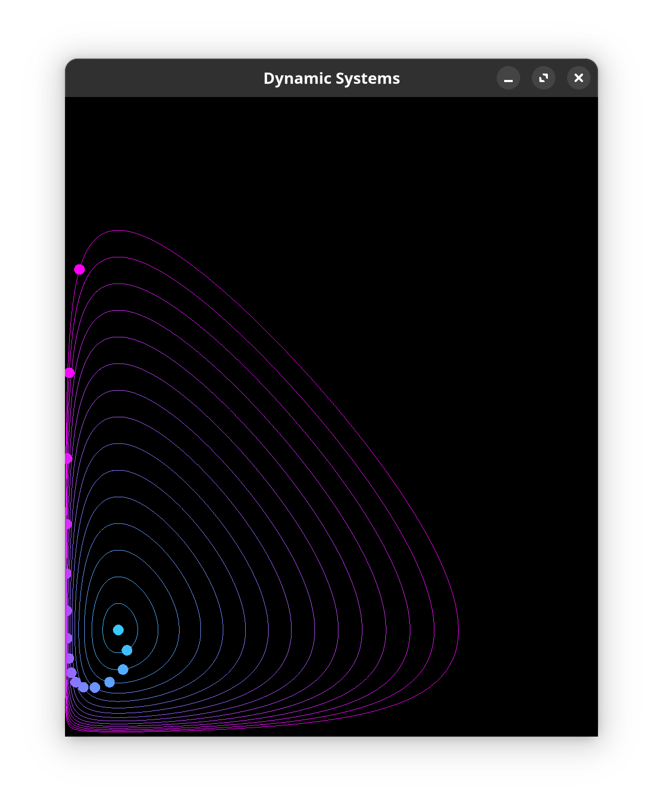

# Dynamic Systems

This project was born out of a necessity to have a visualization tool to assist me during my analytical mechanics excercises.
The code provides a way of setting up a system of differential equations, integrate them and draw the resulting phase space, or
any kind of trajectory based off of orbiting points.

# TODO

- [ ] 3D plotting
- [ ] draw axes
- [ ] lib file with all the systems and their points/plotters
